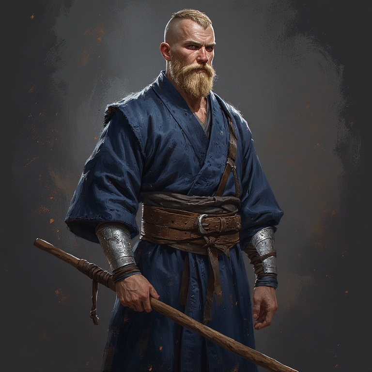

# Session 0

## Introduction

My name is Arkosh Korvash. I am a monk, explorer, seeker of truth, adept of the 
Way of the Open Hand and cleric of the Silver Dragon God, Paladine.  

I come from the Astivar Mountains on Krynn, near the wilds of Nordmaar, and as a child I
was taken in by the monks of Lahue when my village was raided by a war band of
ogres.

When I was little, I lived with dozens of other monks, servants, children, and
refugees in an old monastery near the northern border of the Woods of
Lahue. We were constantly on the watch from raids by the cannibals who inhabit
those lands, and the dark things in the woods which hunt men and ogres. Our monastery 
was more contemplative than religious, although we practices ancient rituals and 
read the words of ancient clerics on dusty scrolls.  
The gods, we were told, had abandoned the world, and there was little point in 
honoring absent gods, especially given the plight of man since our divine abandonment. 
The monks taught reading, meditation, and provided some healing for the local villages. 
They traded occasionally with caravans along the Merchant's Run, and knew little of the
world outside our lands. We were isolated and surrounded by danger, yet we were 
safer than most.  

When I was still a child, my master, a roving wild monk named Kirwa Doshun, took me
as his apprentice. Wild monks, also called *Yamabushui*, or "wild mountain men"
were thought to know the secrets of demons and forest spirits, but they were
usually just men who wanted to avoid even the remnants of civilization found in
the monastery walls. We lived in the woods as hermits, only visiting the
monastery for holy days and required rituals. Master Doshun taught me knowledge
of the wilds, and of herbs, but mostly of our ancient form of hand-to-hand combat. 
He knew little of rituals or religion, but connected with the truest knowledge of
instinct that holy men find when they quiet their minds. He showed me the
secrets to calming my mind, and listening to the quiet voice that remains when
all others fall silent. The voice of the gods, speaking to us from the divine
spark within all of us. I listened for this voice for years, meditating on
mountaintops and under freezing waterfalls to sharpen my spirit. The voice
finally spoke to me, and what it told me changed the word forever: the gods are
not gone.

My time under Master Doshun came to an end when the Dragon Army attacked the
Lahue Monastery. Master Doshun and I came upon the monastery the day after the
attack, and we managed to drive off scavengers who lingered in the area. Many of
the monks had been killed or injured in the raid, but enough had fled or hid
that we could eventually rebuild. I set out to find who had harmed us, and to
recover ancient scrolls which had been taken. That was several years ago, and I
have not heard from my monastery or Kirwa Doshun since.

## Meeting the Heroes of Vogler

[some backstory here]...got captured, Riverbear and Mythindra rescued me. 
We joined forces and defeated a Dragon Army fortress before returning to Kalaman 
and witnessing the assassination of the city council. We took the army of Kalaman 
north into the Northern Wastes, seeking to find something that the Dragon Army 
wanted before they could.

## The City of Lost Names

We found Onyari, the City of Lost Names, and inside an ancient Temple of Paladine.
There I communed with the god and became a cleric of Paladine. The gods had not
abandoned us; they had retreated after the Cataclysm for their own reasons.
Riverbear, Mythindra, and a companion known as Fizban helped me defeat a young 
dragon named Belaphon who had taken the form of a man. We killed Belaphon
and fled the city. The Citadel at the heart of the city, now under control of 
the Death Knight Lord Soth, rose into the air and floated south towards Kalaman.  

## The Battle of Kalaman

Lord Soth brought the flying citadel from Onyari to Kalaman in an attempt to
overrun the walled city with the Red Dragon Army. The city was well-defended and 
with support from locals and visiting heros, we held the walls. Using captured 
dragonelles, we flew into the flying citadel, found ancient secrets there, 
befuddled Lord Soth with an ancient mirror, and extinguished the magical flames 
holding it aloft. As the citadel crashed to the ground, we fought Kansaldi Fire-Eye, 
who was responsible for sacking the monastery. After a fierce battle, both 
Kansaldi and her dragon Igni lay dead, the Citadel of Onyari had crashed to the ground, 
and Kalaman was safe. For now.  

I recovered some ancient scrolls and wrote to my master, telling him of my journey, 
and of the renewed presence of the gods in the world. 
Fizban revealed himself as an avatar of Paladine, and asked me to go on yet another 
quest for him. I agreed. When the Silver Dragon God requests one's aid, one renders it.  

I stepped though a portal of light, and began a new adventure.

## Which Brings Us to Now
