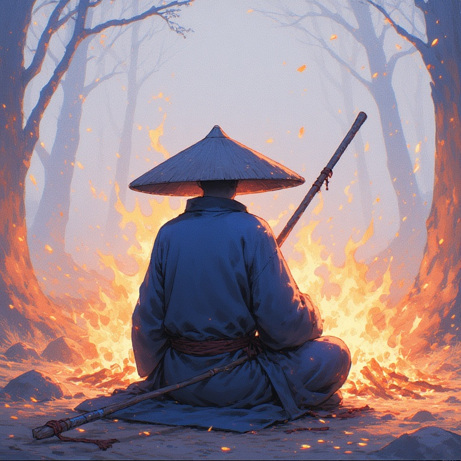
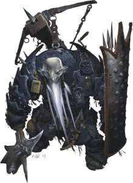

# Session Journal

# General Notes

## Intro Stuff

[Arkosh’s intro](session0.md)

# Party

Tanis Silveroak, Elf.  
Saorice, Druid. Wild elf.  
Balnor, Rune Knight. Tanis’ Bagman.  
Ulfgar Battlehammer, Paladin of Tyr, Order of the Sanguine Rose, First
of His Name, Dwarf.

## Session I

The Old Man led me through a portal of light that stretched between the
stars. I began my journey in a warm and relatively safe tavern in
Kalaman, and walked out of the portal onto another world, finding myself
in a rainy forest next to a windswept plain. Thankfully I still had my
*sandogasa*, a conical hat made of woven straw that was effective at
keeping both sun and rain off my head. Fizban gave me a mysterious
journal, a teapot and some parting advice. He pointed me towards a
distant group of three adventurers already coming down the road in my
direction and told me to help them do whatever it is they’re doing. I
didn’t ask too many questions. The ways of the gods are not meant to be
understood, and I knew enough of Fizban to know that he would not send
me here unless the need was dire. Or unless he had forgotten who he was
or what was happening, but he usually snapped out of that. Anyway.

After some tense introductions, the travelers agreed to share their camp
for the night, and a wild elf druid who was also nearby joined us. As we
shared tea and conversation, it became clear that these were the
adventurers Fizban had sent me here to help. **Tanis Silveroak** was an
elven adventurer with a hidden past. His bag man **Balnor** told me he
was a Rune Knight, and came into Tanis’s service through some kind of
magical pact. Tanis’ companion was a heavily armed Dwarf with a long
list of titles, called **Ulfgar Battlehammer**, Paladin of Tyr. He calls
himself a knight of the Order of the Sacred Rose. Is this related to the
Solamic Order of the Rose? **Saorice** the Wild Elf is a Druid, but did
not offer much else by way of information about her past, apart from the
fact that she grew up in the woods. As I spent most of my early life in
the wilds around Lahue, I feel we may have something in common.

I regaled the party with my story - meeting the Heroes of Volger,
trekking into the Northern Wastes to find the Lost City of Onyari,
discovering waygates and forgotten temples across the hostile desert,
and finding the City of Lost Names after following clues left at a
half-dozen Dragon Army encampments. My friends and I liberated Volger,
saved the city of Kalaman, and slew several dragons, both alive and
undead. I communed with the hidden god Paladine and met his avatar, who
bid me travel here. They listened around the campfire, rapt with
attention as I told of the fierce elven master archer Mythindra (she
could hit a dragon in flight on a story night… much like this one), the
battle-scarred and ferocious half-ogre River Bear (whom I once witnessed
tear a draconid literally in half with his bare hands), and our friend
Gary of Kalaman, a wizard who we lost to a ferocious black dragon in the
Wastes. I told of Fizban, the wizard who helped us flee Onyari and
guided me in my journey to become a cleric, the first such cleric in
decades, if not centuries. I asked to accompany them, and while they
agreed to let me travel with them, they did not seem to trust me yet.
That is wise, and yet I trust them for no other reason than Paladine has
asked that I do.

The next morning we all traveled together to **Tor**, apparently an
important city in this land. Tor is a dwarven city, with towering
obsidian walls build into a cliff face. The city is on the edge of a
large rolling plain, and stormy weather is common. It was raining as we
entered the city and found a tavern. Before long Tanis revealed that he
and Ulfgar were collecting magical artifacts, and that they already had
a magical spear that would point to the other artifacts. The spear led
them to the temple of Thor in Tor, and once we had eaten and had
refreshment, we went to the temple to see the head cleric, **Torak
Axebeard**.

## Session II

The Temple of Thor is a large stone building, where the wild whistles
through large openings in the outer walls and oily torches flutter on
the cold stone walls. We reached the Temple at dusk, as the sun was
setting over the plain. A storm was rolling in, and the rain had already
been falling for hours. Torak Axebeard was confrontational at first, but
Tanis was a cleric of his order and once Torak heard that Tanis
possessed the speak **Gungnir** he agreed to tell us what was happening.
Torak (amazing beard, btw, three braids interwoven with lighting bolt
clasps) told us the hammer we were seeking, **Whelm**, had already been
stolen by Duegar.

After a quick investigation, we followed the Duegar trail several hours
to the Northwest. The storm raged around us, and we lost the tracks
several times, causing delay in our pursuit. Around midnight, we came to
a fissure in a basalt rock face, and it was clear the Duegar had gone
underground. We were exhausted and in no shape to follow an enemy into
its lair, so we set up camp for the night under a massive stone
under-hang in a cliff face that provides concealed view of the fissure.

Saorice and I kept the watch. She only needs a few hours of rest a day,
and I can sleep lightly, knowing that my staff will alert me when danger
is nearby. I took the opportunity to begin this journal, and plan to
chronicle our adventures, such as they are. I expect the one day I will
be asked by Paladine to account for my actions here, and I want to keep
an accurate record. More or less.

We enter the fissure in the morning. Ulfgar believes that the fissure
may lead to the Underdark, which is either the same Underdark from my
world, or something very similar. Perhaps the Underdark connects Krynn
and this place? Perhaps all worlds created by the gods contain their own
distinct Underdark? I cannot say, as I am but a humble monk, not a
scholar of unders dark. Sometimes I miss my conversations with Gary.

## Session III

(this happened in SII)

We entered the fissure at first light. Just inside, the passageway
narrowed in the darkness. A faint light was visible in the distance, and
the distant sound of metal on metal faintly echoed down the dark
corridor. The air smelled of damp stone and rust, with a faint sulfur
odor lingering underneath. Inside, the tunnel angled down, and narrowed
to about 10’ tall and 5’ wide, with rough rock walls and stalactites on
the tunnel ceilings dripping cold water onto our heads. I heard a
constant distant rumble, like the beating of a buried heart.

Tanis and Ulfgar use hand signals to move through the tunnels relatively
quietly. Mostly. While Tanis moves without sound, Ulfgar’s heavy armor
makes scraping and clanking noises even as he tries to move quietly. My
training in stillness and attention are useful - Tanis will scout a
location for safety, then ask me to listen at points where other tunnels
intersect ours. I hear movement, something lurking in the mud below us,
or perhaps other creatures in the tunnels, but we see nothing.

The tunnel opens wider and we are in a large chamber with high ceilings.
Our path turns into an elevated land bridge over what appears to be a
muddy bog about 10’ beneath us. As we navigate this bridge in the
darkness, we are ambushed by Duergar, and must defend ourselves.

(and now on to SIII)
