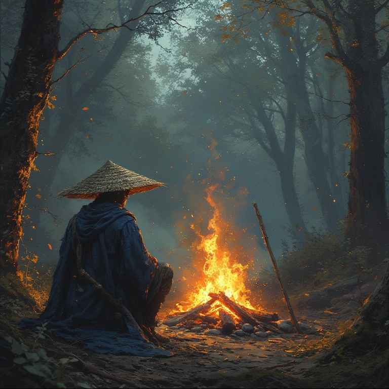
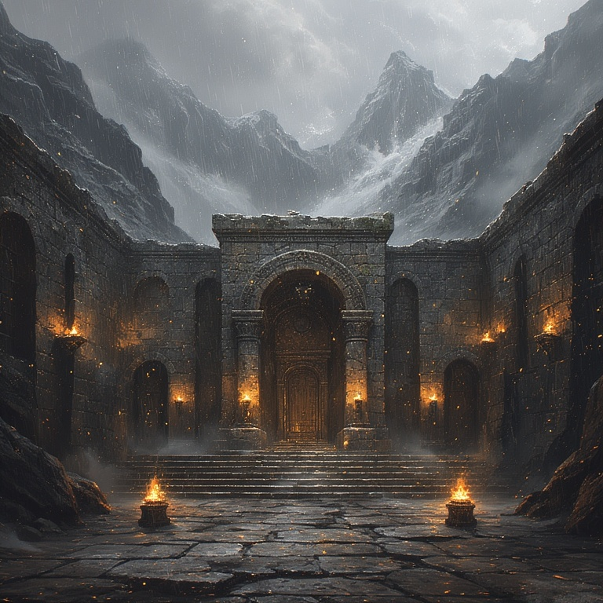
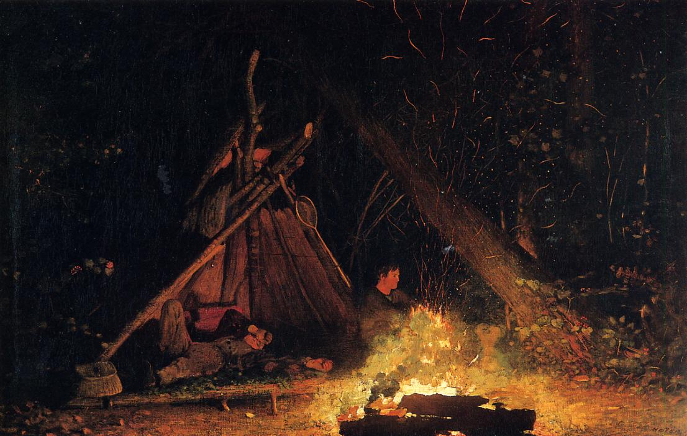
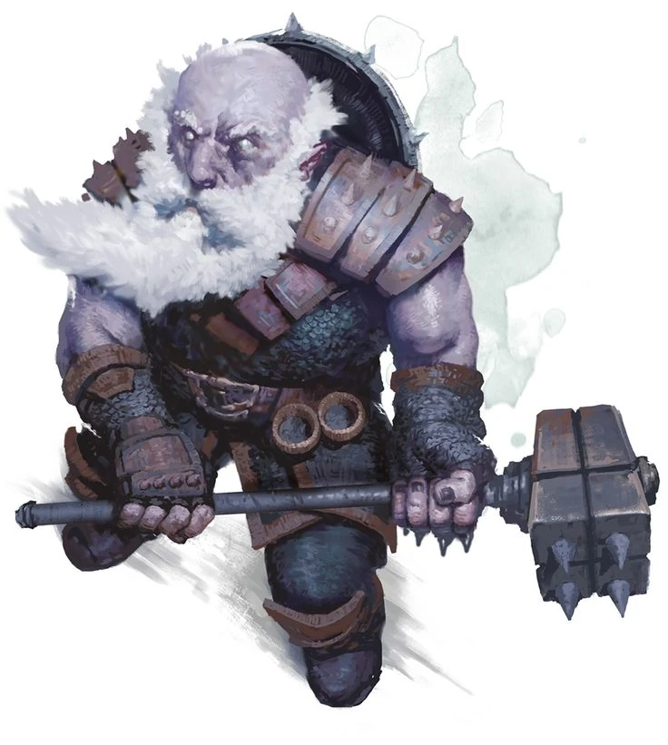
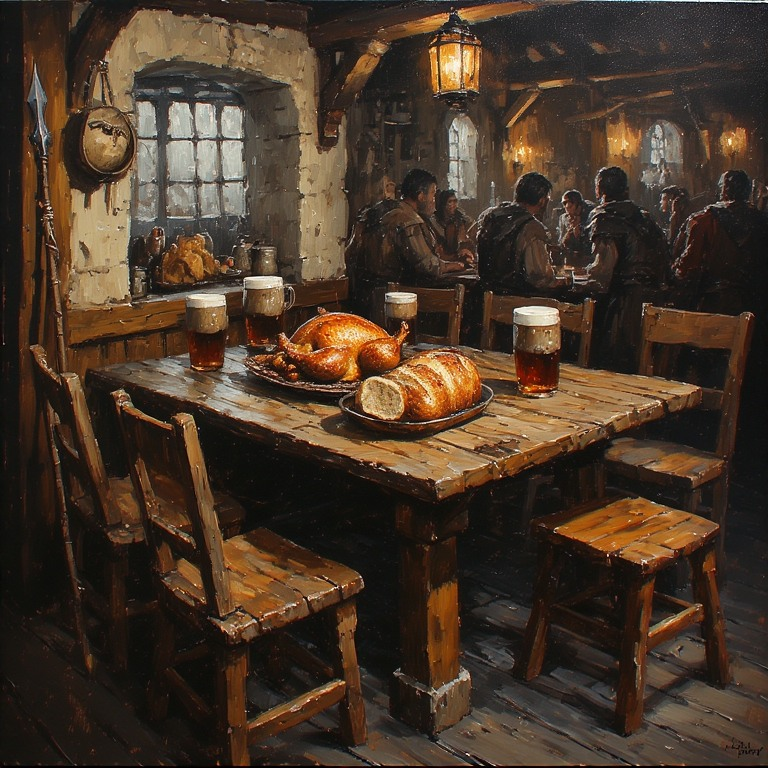

# Session Journal

# General Notes

## Intro Stuff

[Arkosh’s intro](session0.md)

# Party

Tanis Silveroak, Elf.  
Saorice, Druid. Wild elf.  
Balnor, Rune Knight. Tanis’ Bagman.  
Ulfgar Battlehammer, Paladin of Tyr, Order of the Sanguine Rose, First
of His Name, Dwarf.

## Session I

The Old Man led me through a portal of light that stretched between the
stars. I began my journey in a warm and relatively safe tavern in
Kalaman, and walked out of the portal onto another world, finding myself
in a rainy forest next to a windswept plain. Thankfully I still had my
*sandogasa*, a conical hat made of woven straw that was effective at
keeping both sun and rain off my head. Fizban gave me a mysterious
journal, a teapot and some parting advice. He pointed me towards a
distant group of three adventurers already coming down the road in my
direction and told me to help them do whatever it is they’re doing. I
didn’t ask too many questions. The ways of the gods are not meant to be
understood, and I knew enough of Fizban to know that he would not send
me here unless the need was dire. Or unless he had forgotten who he was
or what was happening, but he usually snapped out of that. Anyway.

After some tense introductions, the travelers agreed to share their camp
for the night, and a wild elf druid who was also nearby joined us. As we
shared tea and conversation, it became clear that these were the
adventurers Fizban had sent me here to help. **Tanis Silveroak** was an
elven adventurer with a hidden past. His bag man **Balnor** told me he
was a Rune Knight, and came into Tanis’s service through some kind of
magical pact. Tanis’ companion was a heavily armed Dwarf with a long
list of titles, called **Ulfgar Battlehammer**, Paladin of Tyr. He calls
himself a knight of the Order of the Sacred Rose. Is this related to the
Solamic Order of the Rose? **Saorice** the Wild Elf is a Druid, but did
not offer much else by way of information about her past, apart from the
fact that she grew up in the woods. As I spent most of my early life in
the wilds around Lahue, I feel we may have something in common.

I regaled the party with my story - meeting the Heroes of Volger,
trekking into the Northern Wastes to find the Lost City of Onyari,
discovering waygates and forgotten temples across the hostile desert,
and finding the City of Lost Names after following clues left at a
half-dozen Dragon Army encampments. My friends and I liberated Volger,
saved the city of Kalaman, and slew several dragons, both alive and
undead. I communed with the hidden god Paladine and met his avatar, who
bid me travel here. They listened around the campfire, rapt with
attention as I told of the fierce elven master archer Mythindra (she
could hit a dragon in flight on a stormy night… much like this one), the
battle-scarred and ferocious half-ogre River Bear (whom I once witnessed
tear a draconid literally in half with his bare hands), and our friend
Gary of Kalaman, a wizard who we lost to a terrifying black dragon in
the Wastes. I told of Fizban, the wizard who helped us flee Onyari and
guided me in my journey to become a cleric, the first such cleric in
decades, if not centuries. I asked to accompany them, and while they
agreed to let me travel with them, they did not seem to trust me yet.
That is wise, and yet I trust them for no other reason than Paladine has
asked that I do.

The next morning we all traveled together to **Tor**, apparently an
important city in this land. Tor is a dwarven city, with towering
obsidian walls build into a cliff face. The city is on the edge of a
large rolling plain, and stormy weather is common. It was raining as we
entered the city and found a tavern. Before long Tanis revealed that he
and Ulfgar were collecting magical artifacts, and that they already had
a magical spear that would point to the other artifacts. The spear led
them to the temple of Thor in Tor, and once we had eaten and had
refreshment, we went to the temple to see the head cleric, **Torak
Axebeard**.

## Session II

The Temple of Thor is a large stone building, where the wind whistles
through large openings in the outer walls and oily torches flutter on
the cold stone walls. We reached the Temple at dusk, as the sun was
setting over the plain. A storm was rolling in, and the rain had already
been falling for hours. Torak Axebeard was confrontational at first, but
Tanis was a cleric of his order and once Torak heard that Tanis
possessed the speak **Gungnir** he agreed to tell us what was happening.
Torak (amazing beard, btw, three braids interwoven with lighting bolt
clasps) told us the hammer we were seeking, **Whelm**, had already been
stolen by Duegar.

After a quick investigation, we followed the Duegar trail several hours
to the Northwest. The storm raged around us, and we lost the tracks
several times, causing delay in our pursuit. Around midnight, we came to
a fissure in a basalt rock face, and it was clear the Duegar had gone
underground. We were exhausted and in no shape to follow an enemy into
its lair, so we set up camp for the night under a massive stone
under-hang in a cliff face that provides concealed view of the fissure.

Saorice and I kept the watch. She only needs a few hours of rest a day,
and I can sleep lightly, knowing that my staff will alert me when danger
is nearby. I took the opportunity to begin this journal, and plan to
chronicle our adventures, such as they are. I expect the one day I will
be asked by Paladine to account for my actions here, and I want to keep
an accurate record. More or less.

We camp for the night and plan to enter the fissure in the morning.
Ulfgar believes that the fissure may lead to the Underdark, which is
either the same Underdark from my world, or something very similar.
Perhaps the Underdark connects Krynn and this place? Perhaps all worlds
created by the gods contain their own distinct Underdark? I cannot say,
as I am but a humble monk, not a scholar of unders dark. Sometimes I
miss my conversations with Gary.

We entered the fissure at first light. Just inside, the passageway
narrowed in the darkness. A faint light was visible in the distance, and
the distant sound of metal on metal faintly echoed down the dark
corridor. The air smelled of damp stone and rust, with a faint sulfur
odor lingering underneath. Inside, the tunnel angled down, and narrowed
to about 10’ tall and 5’ wide, with rough rock walls and stalactites on
the tunnel ceilings dripping cold water onto our heads. I heard a
constant distant rumble, like the beating of a buried heart.

Tanis and Ulfgar use hand signals to move through the tunnels relatively
quietly. Mostly. While Tanis moves without sound, Ulfgar’s heavy armor
makes scraping and clanking noises even as he tries to move quietly. My
training in stillness and attention are useful - Tanis will scout a
location for safety, then ask me to listen at points where other tunnels
intersect ours. I hear movement, something lurking in the mud below us,
or perhaps other creatures in the tunnels, but we see nothing.

The tunnel opens wider and we are in a large chamber with high ceilings.
Our path turns into an elevated land bridge over what appears to be a
muddy bog about 10’ beneath us. As we navigate this bridge in the
darkness, we are ambushed by Duergar, and must defend ourselves.

## Session III

Ulfgar swings his mighty axe, hewing many foes. A massive clap of
thunder accompanies each of his strikes, flinging Duergar into walls and
rending their bodies. Unfortunately, the booming strikes draw many foes
to us, and we are quickly surrounded.

Balnor is defending the rear of the party and quickly becomes
overwhelmed by several Duergar warriors and a magic user. The warriors
grow to giant size and land several fierce blows, but Balnor holds his
own. Arkosh sprints to his aid while Tanis, Ulfgar, and Saorice fight
the Duergar to our front.

We realize that Ulfgar’s thunderous strikes are responsible for
summoning more foes, and we endeavor to tread more quietly as we go on.
Balnor requires some healing and Arkosh provides a healing potion from
his bag. We rest a few minutes in a narrow passage to the North before
pressing on, and I take the opportunity to scribble down these notes.

## Session VI

After the enemies are defeated, we again follow the trail of the temple
thieves. The passageway curves right, to the East, and we find a very
narrow passage roughly hewn through the stone wall at the end of a small
alcove. This passageway is so narrow that a human would be pressed
between the stone walls, unable to even turn. Tanis pushes his way into
the passageway but panics when he becomes stuck. Arkosh pushes in after
him and casts Heroism on him, magically removing his fear. Tanis backs
out of the passage and Saorice transforms Balnor into a rat so that he
can run through the passageway unimpeded. Balonr sneaks into the passage
and finds rooms at the end with guards. He returns, transforms back into
a human, and tells us what he saw. We decide to find another way into
the area Balnor found, avoiding for now the narrow, panic-inducing
passageway.

To the South, an open passage into a series of well-made tunnels looms.
Arkosh uses his sylvan cloak to sneak into the tunnels, and hears the
guards. The party moves in behind him and they prepare to move deeper
into the well-crafted corridor, clearly part of some underground
fortress.

## Session V

We enter into well-cut stone corridors, like a castle under the
mountain. In one side chamber we see two Duegar battlemasters arm
wresting. The room has overturned tables and evidence of a battle.
Arkosh casts silence and the crew charges in, surprising the dark
dwarves. These are tough opponents but we defeat them, then barricade
this room and rest, confident that no one else heard us.

After resting, we continue following the tunnels into the darkness.
Saorice sends Balnor in rat form ahead to scout, and he finds a small
attic room with a ring of warmth that she pockets.

We continue until a voice calls out to us from a throne room up ahead.
We enter and stand before Khuldren Blackvein, a duegar general who now
wields the blessed hammer Whelm.

> (As the adventurers enter, Khuldren rises slowly from the basalt
> throne, molten cracks pulsing beneath his armor. His voice echoes
> through the chamber—deep, gravelly, and seething with conviction.)
>
> “You feel it, don’t you? The silence of your gods.  
> The stillness in your prayers where once there was thunder.  
> Thor has abandoned you—abandoned all of us.  
> His hammer sleeps no longer in the hands of the unworthy… it answers
> now to me!”
>
> “I see doubt and contempt in your faces. Perhaps a demonstration.”
>
> (He lifts a massive blackened hammer — Whelm, its glow turned to a
> dull red pulse. He turns to Bal’nor, points the hammer and
> reddish-blue lightning explodes towards the man, engulfing him in
> energy. Bal’nor falls.)
>
> “Now that I have your attention… For ages we Duergar have slaved in
> the shadows of your golden kin. They call us traitors, heretics,
> madmen — yet it was they who betrayed our kind first, chaining us to
> the mountains while they drank and sang beneath Thor’s lightning!
>
> But I have heard the true song of the deep.  
> It rings in stone and iron — not in thunderclouds.  
> The gods above are gone, their light extinguished…  
> And in that darkness, I have forged my own divinity.”
>
> (He slams Whelm against the stone, a shockwave ripples through the
> room — molten lines flare in the floor’s runes.)
>
> “This hammer was meant to smite evil, to defend the faithful. Now it
> will shatter the idols of false gods! The dwarves of the surface will
> bow to Blackvein’s law or burn in their forges. No more prayers. No
> more chains. Only obedience… and fire.”
>
> (He points Whelm toward the party, eyes burning red.)
>
> “You come seeking to reclaim what your dead gods lost?  
> Then come — feel the weight of true faith.”
>
> “I am Khuldren Blackvein — and I am the thunder now.”

Khuldren strikes down Balnor with a lightning bolt and we begin combat.

## Session VI

Arkosh leaps forward to attack Khuldren but the dwarf’s armor turns his
quarterstaff aside. Khuldren questions who Arkosh is and why he’s here
before brushing past him and attacking Ulfgar. (“How does your god like
*that*”)

Ulfgar uses his searing smite to coat his blade in holy fire as he
swings. Tanis casts bane on Khuldren and company while Saorice shoots
from the far side of the room.

Khuldren climbs the dias and grows to massive size, then holds Whelm
aloft. The hammer emits a thunderclap that stuns everyone in the room.
While we are daved, Khuldren leaps into the air and crashes down with
Whelm, knocking everyone to the ground. We are prone, stunned, and
surrounded by giants with hammers. The guards hammer Ulfgar and Tanis,
damaging them. Arkosh gets lucky and rolls under the throne to avoid the
guard’s strikes.

Tanis yells to Saorice to check the bag of holding and then points at
Balnor.  
Saorice opens the bag and sees the bow Bjarndr; she must choose between
a scroll of revivify for Balor or the bow. She chooses the bow, and as
she grasps it, the bow instantly attunes to her. She action surges and
then pulls out the scroll and uses it on Balnor, who opens his eyes as
he lays smoldering on the floor. Saorice casts healing sprirt and an
image of an owlbear appears next to Balor, its energies healing him.

## Session VII

Arksoh gets on his feet and calls out to Paladine for strength. He uses
channel divinity: balm of peace to move between party members and heal
them. Khuldren shoves past and attacks Balnor again, slamming into him
with his hammer, crushing Balnor’s head. He then sits Whelm’s head next
to Balnor’s broken face before detonating the thunderclap again,
throwing Ulfgar from his feat and killing Balnor again. As Khuldren
turns to attack the prone Ulfgar, Arkosh uses Gungnir to stab at
Khuldren, wounding him.

A guard slams Ulfgar again as he’s prone before scoring a critical hit
on Arkosh, breaking his ribs and slamming him into the wall. Saorice
shoots the guard with an exploding arrow, raining little duegar bits all
over Arkosh.

Tanis kiss one guard and Ulgar rises to his feet as Khuldren is paused
from Arkosh’s stab.

Ulfgar lifts his head, blood covering his face, and turns to Khuldren.
“I will erase your entire bloodline! I will wipe you from history. This
is my vow!” (vow of enmity). The words shake Khuldren. Ulfgar cuts him
down with his flaming sword.

Khuldren falls to his knees, but befofe Ulfgar can land the killing
blow, time slows to a crawl and sound fades to a dull. flat rumble. A
voice comes from Khuldren.  
The voice tells Tanis and Ulfgar they’re pawns, that the voice has been
manipulating them from the start, and that they are not to go to Corvas.

The thing wearing Khuldren like a suit drops Whelm at Tanis’ feet.

Tanis recognizes the voice but can’t place it. Arkosh and Saorice are
initially quiet but give their names after Tanis says it’s safe to do
so. The voice tells them this is their final warning and then Khuldren
and the other guards write and twist as their bodies are painfully
crushed, and then the spirit is gone. All the duergar are dead.

Tanis attunes to Whelm and the hammer tells him there’s a hidden
compartment nearby, where we retrieve an Amulet of Health (sets Con to
19). Arkosh uses the spear Gungnir to identify the amulet and Tanis lets
him keep it. We decide to return to Tor. On the way out, we find more
dead duergar, apparently in route to reinforce Blackvein when they died.

We return to Tor by nightfall, and make our way to the tavern near the
Western gate. The tavern is crowded and noisy, but we manage to find a
corner table and Tanis and Ulfgar relate their story to us.

